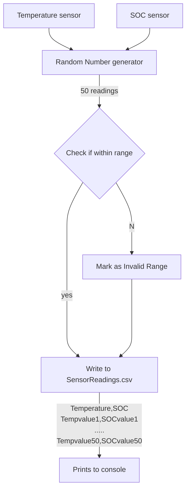

##  Sender : Streaming BMS Data

## Quality Parameters
Quality parameters used in this repo and updated in `.github/workflows` folder

- Maximum complexity (CCN) per function:  3 CCN 
- Lines of duplicate code allowed: 2 
- Ensure 100% line and branch coverage at every step. Included the coverage yml in the workflows.

##  Sender Flowchart

## Implemented functionality

- Two battery parameters are considered here - Temperature and SOC
- Min and Max limits for these are also pre-defined
- 50 readings(This number can be changed as required) of each parameter is genereted using random generation to a csv file (SensorInput.csv)
- Readings will be within the MIN and MAX limits defined
- After the csv file generation, SensorInput.csv is read and prints the contents to console
- If the file does not exist/ not created, returns None
- The console will have the heading with battery paramters and the sensor readings separeted by ,
Example : 

Temperature,SOC

Tempvalue1,SOCvalue1

.....

Tempvalue50,SOCvalue50

## How to call the sender function

1. Name file to store sensor readings
2. Call WriteSensorInput function that generates the readings using random generator
3. Call ReadSensorReadings function to read the generated csv and prints to console

 file = 'SensorReadings.csv'

 WriteSensorInput(file)

 ReadSensorReadings(file)

## Tests added

- Checks if SensorInput.csv file is generated
- Test the negative case with a non-existing file
- Generates a temporary file and check the file generation function. After test remove this temp file
- Tests read out from the csv
- Confirms the sensor readings are within the limits
- Invalid range test
    - Created a InvalidRange.csv with readings out of range for temperature and SOC
    - Checks if the csv is read
    - test the readings against limit and return false for out of range readings

